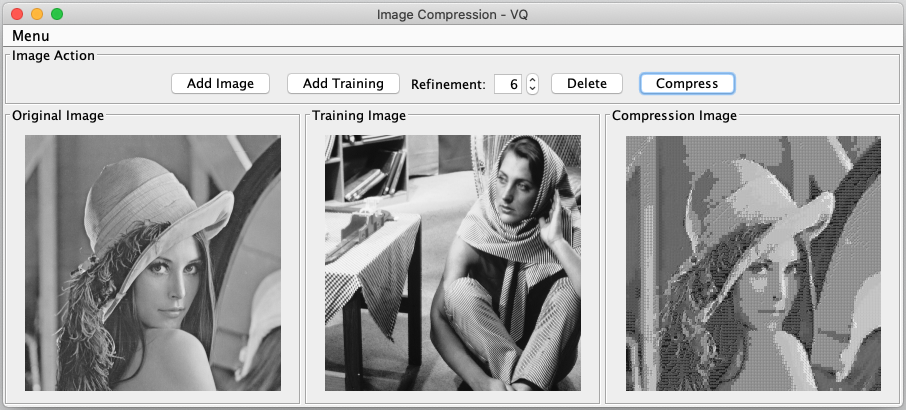
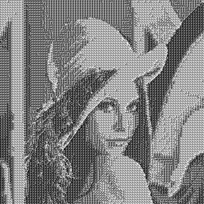

# VQ Compression

Image compression application with the lossy vector quantization (VQ) data compression technique.

## Table of Contents

* [General Info](#general-info)
* [Graphical User Interface](#graphical-user-interface)
* [Results](#results)
* [Features](#features)
* [Technologies](#technologies)
* [Setup](#setup)
* [Sources](#sources)

## General Info

Vector quantization procedure:

1. Codebook creation with prototype vectors
2. Encoding: association of the image vectors to the codebook using distance criteria
3. Decoding using look up table

## Graphical User Interface

    

* Add Image: image that will be compressed
* Add Training: training image for better compression result (optional)
* Refinement: number of iteration for the re-finement process on the training image (max. 60)
* Delete: deletes added images from the application
* Compress: starts the compression process

## Results

### With Training Image

    
    
    

### Without Training Image

    
    

## Technologies

* **Language**: Java
    * **Library**: OpenCV

## Setup

To run this application you need Java and to add the OpenCV JAR to your preferred IDE. You can find a tutorial to install OpenCV [here](https://opencv-java-tutorials.readthedocs.io/en/latest/01-installing-opencv-for-java.html#introduction-to-opencv-for-java).

## Sources

* [Java](https://www.java.com/en/)
* [OpenCV](https://opencv.org/)